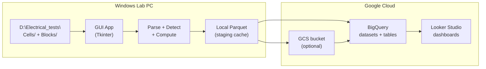

# Geyser Cycler Analysis Tool -- Revised Plan

## Living document — keeping this plan up to date

This file is the **engineering record**: phased goals, backlog, architecture notes, and an **implementation changelog**. It is meant to drift **only when someone updates it**.

**When you change behaviour, UX, schemas, or protocol rules**, refresh these in tandem:


| Change type                                    | Update                                                                                                   |
| ---------------------------------------------- | -------------------------------------------------------------------------------------------------------- |
| User-visible flows                             | [Tool/README.md](../Tool/README.md) — functional overview, CLI/GUI flags                                 |
| Looker dimensions / metric names               | [Tool/docs/LOOKER_SETUP.md](../Tool/docs/LOOKER_SETUP.md)                                                |
| Protocol keywords (`STANDARD_CELL`, `BLOCK_*`) | [Tool/geyser_tool/protocol/registry.yaml](../Tool/geyser_tool/protocol/registry.yaml)                    |
| CYCLABILITY thresholds, regexp, precedence     | [Tool/geyser_tool/protocol/detector.py](../Tool/geyser_tool/protocol/detector.py)                        |
| Phased scope / backlog / “what landed when”    | **This plan** — add a dated entry under §11 Implementation Changelog; adjust frontmatter todos if needed |


**Superseded content:** Older sections still mention labels like `**VTT_TEST1_BLOCK`** or scored pattern matching—they are retained as narrative context unless removed. Prefer the **changelog** and `**Tool/`** docs for truth about the **running** codebase.

---

## 1. What the tool does (high level)




- **Input**: CLK summary files and RAW per-cycle files from `D:\Electrical_tests\Cells\` and `D:\Electrical_tests\Blocks\`. Folder structures are **usually** `YYYY\MM\DD\N_Gnn\NNN\`, but the tool primarily infers IDs/dates from the `Object:` header and `YYMMDD` patterns so it remains robust when `N_Gnn` or `NNN` are missing or renamed.
- **Processing**: Parse metadata headers, detect protocol, extract per-cycle/step metrics from CLK, optionally recompute ESR from RAW, generate curve points.
- **Output**: BigQuery tables (canonical DB), Looker Studio dashboards (analytics), local Parquet staging cache.
- **Trigger**: User clicks "Update BigQuery" in a small Windows GUI, or runs a CLI command.

---

## 2. Key insight from your actual files

Your cycler (ACK75.10.20.12 / ACK75.48.1750.1) already stores **the full program definition in every file header** (both CLK and RAW). For example:

```
Analyzer: ACK75.10.20.12  IP: 192.168.100.141  Channel: 4
Object: 260203_1_G01_033_C_001
Program:
 1 Charge CC 2.5A to 0.5V or 10000s. Period ESR: 1s. Duration ESR: 1000Hz.
 2 Scanning U 10mV/s frm 0.5V to 1.72V. I subrange 10A.
 3 Scanning U 10mV/s frm 1.72V to 0.5V. I subrange 10A.
 4 Cycle to step 2   3 times.
 5 Charge CC 4.5A to 1.7V or 10000s. Period ESR: 1s. Duration ESR: 1000Hz.
 6 Discharge CC 4.5A to 0.85V or 10000s. ESR: Not meas.
 7 Cycle to step 5   20 times.
...
```

This is the **protocol fingerprint**. The tool will parse these program lines into a structured `ProgramDefinition`, then match it against known protocol templates (and also handle unknown protocols gracefully).

Additionally, the CLK file already contains **pre-computed per-step and per-cycle metrics**: `Q,Ah`, `E,Wh`, `C,F`, `ERc,mR`, `ERd,mR`, `ESR,mR`, `Ilk,A`, `EFq,%`, `EFe,%`. These are **trusted** and will be ingested directly. ESR recomputation from RAW is a separate, optional step for custom time windows (e.g., ESR at 10ms and 1s per your SOP Section 3D).

---

## 2.1 Step tags and modes (from manual + data)

The ASK/ACK75 analyzers use a rich set of step markers in both RAW and CLK files. The tool will normalize these into a small set of canonical `step_type` values via an explicit mapping table. The following markers are expected (from the ASC75 manual and your `Electrical_tests` data):

- **Constant current / voltage / power / resistance steps**
  - Charge: `CHCC`, `CCC` (charge constant current), `CHCV` (charge constant voltage), `CHCP` (charge constant power)
  - Discharge: `DCHCC`, `DCCC`, `DCC` (discharge constant current), `DCV` / `DCHCV` (discharge constant voltage), `DCHCP` (discharge constant power), `DCHCR` / `DCR` (discharge to constant resistance)
- **Scans / sweeps**
  - `SNU` (voltage scan), `SNI` (current scan), `SNP` (power scan), `SNR` (resistance scan)
- **Relaxation and logging**
  - `RLX` / `RLAX` (relaxation), `LGU` (voltage logger)
- **Table-driven profiles**
  - `TBU` / `Table U` (voltage table), `TBI` / `Table I` (current table), `TBP` / `Table P` / `TBLP` (power table), `TBR` / `Table R` (resistance table)
- **Pulse modes**
  - `IPI` (current pulse mode), `IPU` (voltage pulse mode), `IPP` (power pulse mode), `IPR` (resistance pulse mode)
- **Other**
  - `MPPT` (maximum power point tracking), `U recorder` / `LGU` (voltage recorder), `Pause`, plus summary `GNRL` lines.

All these markers will be mapped into canonical `step_type` enums (e.g., `CCC`, `DCC`, `CV_CHARGE`, `CV_DISCHARGE`, `SCAN_V`, `RELAX`, `LOGGER`, `TABLE_POWER`, `PULSE_CURRENT`, etc.) that the protocol detector and metric logic use. This makes the system robust as new protocols are introduced while still leveraging the analyzer’s native tagging.

---

## 3. Protocol detection engine

### 3.0 Implemented labels (canonical; 2026-05)

Values written to BigQuery as `**test_runs.protocol_detected`**:


| Label            | Where defined                                                                | Summary                                                                                                                                                                                                                                                                                                 |
| ---------------- | ---------------------------------------------------------------------------- | ------------------------------------------------------------------------------------------------------------------------------------------------------------------------------------------------------------------------------------------------------------------------------------------------------- |
| `CYCLABILITY`    | [detector.py](../Tool/geyser_tool/protocol/detector.py) runs **before** YAML | **Cell path:** `Charge CC`, correct `Discharge CC`, regexp `Cycle to step <step> <n> times` with `**n > 20`**, and joined program text must **not** contain typo `Discarge CC`. **Block path:** `Charge CC`, typo `Discarge CC`, line `Preset number of cycles: N` with `**N > 20`**. Confidence `0.5`. |
| `STANDARD_CELL`  | [registry.yaml](../Tool/geyser_tool/protocol/registry.yaml) (first row)      | `Scanning U` + `Charge CC` + `Discharge CC` + `Charge CV` + (`Rest` **or** `Logger U`).                                                                                                                                                                                                                 |
| `BLOCK_SCANNING` | registry (second row)                                                        | `Scanning U` + `Preset number of cycles`.                                                                                                                                                                                                                                                               |
| `BLOCK_CYCLING`  | registry (third row)                                                         | `Discarge CC` + `Rest` + `Preset number of cycles` (any `N`, including ≤ 20).                                                                                                                                                                                                                           |
| `UNKNOWN`        | implicit                                                                     | Nothing matched YAML + detector fallbacks (if registry absent).                                                                                                                                                                                                                                         |


`ProgramStep.params` / `cycle_ref` in [program_model.py](../Tool/geyser_tool/protocol/program_model.py) support future structured parsing; today `**pipeline._program_from_header`** fills `**step_num**` and `**mode**` only — detection is substring / regexp matching on concatenated `**mode**` text ([detector.detect_protocol](../Tool/geyser_tool/protocol/detector.py)).

### 3A. Target data model for program steps

Each program header is parsed into a list of `ProgramStep` objects:

```python
@dataclass
class ProgramStep:
    step_num: int
    mode: str          # "Charge CC", "Discharge CC", "Scanning U", "Charge CV", "Logger U", etc.
    params: dict       # current_a, voltage_v, scan_rate, duration_s, esr_config, etc.
    cycle_ref: tuple   # (target_step, n_times) if this is a "Cycle to step X, N times"
```

### 3B. Historical SOP-aligned pattern taxonomy (*superseded for labels; design reference*)


| Protocol Label        | Step Sequence Pattern                                                                           | Source Doc                        |
| --------------------- | ----------------------------------------------------------------------------------------------- | --------------------------------- |
| `STANDARD_CELL`       | High-level CCC/SNU/DCC sequencing (conceptual SOP §3C)                                          | SOP Section 3                     |
| ~~`VTT_TEST1_BLOCK`~~ | *(label retired in code)* replaced by `**BLOCK_SCANNING*`* / `**BLOCK_CYCLING**` heuristic rows | Was ToS §7 wording - Discontinued |
| `VTT_FCRD_NONZINC`    | `CCC -> CCV -> TableP -> DCC`                                                                   | ToS Section 8                     |
| `CYCLABILITY`         | `CCC(to 1.70V) -> DCC(to 0.80V) -> Cycle(N>=1000)`                                              | SOP Section 5                     |
| `REFERENCE_GCD`       | `CCC(0.85->1.70V) -> DCC(1.72->0.80V) -> Rest(2min) -> Cycle(3)`                                | SOP Section 5 - Discontinued      |
| `DCIR_SOC`            | Complex pulse sequence with rest                                                                | SOP Section 6                     |


If **no** implemented rule matches (§3.0 + YAML + fallbacks), the protocol is `**UNKNOWN`**; CLK / RAW metrics are still ingested.

### 3C. Why this is robust to protocol changes

- **YAML** entries for `STANDARD_CELL` / `BLOCK_*` are editable without changing Python. `**CYCLABILITY`** requires code changes in `**detector.py**` when thresholds or shapes change.
- Unknown protocols still get full metric ingestion from CLK.
- The program header text is also stored verbatim in BigQuery for traceability.

---

## 4. Metric extraction strategy

### 4A. Metrics ingested directly from CLK (trusted, no recomputation)

Per-step rows and GNRL (per-cycle summary) rows in CLK already contain:


| CLK Column | Metric                                                   | Unit |
| ---------- | -------------------------------------------------------- | ---- |
| `Q,Ah`     | Capacity (charge/discharge)                              | Ah   |
| `E,Wh`     | Energy (charge/discharge)                                | Wh   |
| `C,F`      | Capacitance (from DCHCC 10-90% method per manual Sec 14) | F    |
| `ERc,mR`   | ESR at charge step change                                | mOhm |
| `ERd,mR`   | ESR at discharge step change                             | mOhm |
| `ESR,mR`   | ESR from periodic current interruption                   | mOhm |
| `EFq,%`    | Coulombic efficiency                                     | %    |
| `EFe,%`    | Energy efficiency                                        | %    |
| `Ilk,A`    | Leakage current                                          | A    |
| `Drt,s`    | Step/cycle duration                                      | s    |


These are the **primary source of truth** for all protocols.

### 4B. ESR recomputation from RAW (protocol-specific, optional but important)

For protocols where your SOP defines specific ESR windows (e.g. Standard Cell and block-style discharge tests), the tool will **also** compute ESR from RAW data:

**Standard Cell ESR (SOP Section 3D)**:

1. Find the discharge-to-rest transition: the first sample where `|I| <= 0.02 * I_discharge`. Define this as `t=0`.
2. `VEND` = last voltage sample where `|I| >= 0.98 * I_discharge`.
3. `V10ms` = voltage at `t = 10 ms` after current release (nearest sample; NaN if no sample within 0.5*dt).
4. `V1s` = voltage at `t = 1.0 s` after current release (same rule).
5. `ESR10ms = (V10ms - VEND) / |I_discharge|`
6. `ESR1s = (V1s - VEND) / |I_discharge|`

**Strict vs. practical tradeoff** (you asked to see both):

- **Strict doc-true**: ESR is NaN unless a sample exists exactly at 10ms/1s within 0.5*dt. At 10 Hz (dt=100ms), ESR10ms is **always NaN** (no sample at 10ms). At 100 Hz (dt=10ms), ESR10ms is valid.
- **Practical relaxation**: Allow configurable tolerance (e.g., nearest sample within 20ms of target). Flag as `approximate` when tolerance > 0.5*dt.
- **Recommendation**: Default to strict for cells (100 Hz, 10ms ESR is valid). For blocks (10 Hz), ESR10ms is reported as NaN with reason "sample rate insufficient"; ESR1s is valid. Users can enable relaxed mode in settings.

**Block-style discharge ESR (historical ToS §7.5 wording)**:
Same formula but applied to block-level discharge cycles. Report average of last 5 cycles.

### 4C. Protocol-specific metric rules (dispatch table — *design sketch*)

*Generated for planning; `**geyser_tool` does not currently centralize routing in a `PROTOCOL_METRICS` dictionary**. ESR/curve pipelines may still behave largely independent of `**protocol_detected`** — confirm in `**analysis/**` and `**upload/bigquery.py**` when wiring protocol-aware behaviour.*

```python
PROTOCOL_METRICS = {
    "STANDARD_CELL": {
        "esr_recompute": True,
        "esr_windows_s": [0.010, 1.0],
        "esr_reference_cycle": "last_5_avg",
        "capacitance_source": "clk",        # trust cycler computation
        "qref_eref_cycle": 3,               # 3rd discharge cycle
        "build_ocv_soc": True,
        "curves": ["CV", "CYCLING", "DQDV"],
    },
    "BLOCK_CYCLING": {  # formerly sketched as VTT_TEST1_BLOCK
        "esr_recompute": True,
        "esr_windows_s": [0.010, 1.0],
        "esr_reference_cycle": "last_5_avg",
        "capacitance_source": "clk",
        "kpi_report": True,                 # generate pass/fail KPIs per ToS
        "curves": ["CYCLING"],
    },
    "CYCLABILITY": {
        "esr_recompute": False,              # not needed for cycle life
        "track_degradation": True,           # flag capacity fade
        "curves": ["CYCLING"],
    },
    "UNKNOWN": {
        "esr_recompute": False,
        "capacitance_source": "clk",
        "curves": ["CYCLING"],
    },
}
```

### 4D. RAW time-series storage (all RAW files)

For **all** RAW files associated with each CLK run, the tool stores the full time-series in BigQuery:

- **Per-sample data**: time, voltage, current, temperature, capacity (Ah), energy (Wh)
- **Per-step context**: `step_no`, `step_type` (e.g. CCC, DCC, SNU) for each sample
- **Time concatenation**: In RAW files, `Time,s` resets to zero at each step. The tool **concatenates time** so that `time_s` is monotonically increasing from program start to end:
  - Within each RAW file: add cumulative offset per step (sum of previous step durations)
  - Across multiple RAW files (per cycle): add cycle-based offset so the full program timeline is continuous

This enables graph building (V–t, I–t, Ah–t, etc.) over the entire test program.

---

## 5. Data model (BigQuery tables)

### 5A. `test_runs` -- one row per file processed


| Column              | Type      | Description                                                   |
| ------------------- | --------- | ------------------------------------------------------------- |
| `run_id`            | STRING    | SHA256 hash of file path + size + mtime                       |
| `index_id`          | STRING    | e.g., `260203_G01_033`                                        |
| `object_id`         | STRING    | Full Object field from header, e.g., `260203_1_G01_033_C_001` |
| `entity_type`       | STRING    | `cell` or `block`                                             |
| `protocol_detected` | STRING    | e.g., `STANDARD_CELL`                                         |
| `program_text`      | STRING    | Verbatim program header                                       |
| `analyzer_model`    | STRING    | e.g., `ACK75.10.20.12`                                        |
| `channel`           | INT64     | Channel number                                                |
| `sample_rate_hz`    | FLOAT64   | Detected from RAW                                             |
| `test_started`      | TIMESTAMP | From header                                                   |
| `source_path`       | STRING    | Local file path                                               |
| `processed_at`      | TIMESTAMP | When ingested                                                 |


### 5B. `cycle_metrics` -- one row per cycle per file (from CLK GNRL lines)


| Column              | Type    |
| ------------------- | ------- |
| `run_id`            | STRING  |
| `index_id`          | STRING  |
| `cycle_no`          | INT64   |
| `duration_s`        | FLOAT64 |
| `voltage_end_v`     | FLOAT64 |
| `current_end_a`     | FLOAT64 |
| `temperature_c`     | FLOAT64 |
| `esr_periodic_ohm`  | FLOAT64 |
| `capacity_ah`       | FLOAT64 |
| `energy_wh`         | FLOAT64 |
| `capacitance_f`     | FLOAT64 |
| `esr_charge_ohm`    | FLOAT64 |
| `esr_discharge_ohm` | FLOAT64 |
| `leakage_current_a` | FLOAT64 |
| `coulombic_eff_pct` | FLOAT64 |
| `energy_eff_pct`    | FLOAT64 |


### 5C. `step_metrics` -- one row per step per cycle (from CLK per-step lines)

Same structure as `cycle_metrics` but with added `step_no`, `step_tag` (e.g., `5CCC`, `6DCC`), and `step_type` (e.g., `CCC`, `DCC`, `SNU`, `CCV`).

### 5D. `esr_computed` -- recomputed ESR from RAW (when applicable)


| Column           | Type    |
| ---------------- | ------- |
| `run_id`         | STRING  |
| `index_id`       | STRING  |
| `cycle_no`       | INT64   |
| `step_no`        | INT64   |
| `direction`      | STRING  |
| `delay_s`        | FLOAT64 |
| `esr_ohm`        | FLOAT64 |
| `v_end_v`        | FLOAT64 |
| `v_at_delay_v`   | FLOAT64 |
| `current_a`      | FLOAT64 |
| `sample_rate_hz` | FLOAT64 |
| `is_approximate` | BOOL    |
| `reason`         | STRING  |


### 5E. `time_series` -- full RAW time-series per sample


| Column          | Type    | Description                                        |
| --------------- | ------- | -------------------------------------------------- |
| `run_id`        | STRING  | Links to test_runs                                 |
| `index_id`      | STRING  | e.g. 260203_G01_033                                |
| `cycle_no`      | INT64   | Cycle number                                       |
| `step_no`       | INT64   | Step number (e.g. 5, 6)                            |
| `step_type`     | STRING  | Canonical step type (CCC, DCC, SNU, etc.)          |
| `seq`           | INT64   | Sample sequence within run                         |
| `time_s`        | FLOAT64 | **Concatenated** time from program start (seconds) |
| `voltage_v`     | FLOAT64 | Voltage (V)                                        |
| `current_a`     | FLOAT64 | Current (A)                                        |
| `temperature_c` | FLOAT64 | Temperature (°C)                                   |
| `capacity_ah`   | FLOAT64 | Capacity (Ah)                                      |
| `energy_wh`     | FLOAT64 | Energy (Wh)                                        |


### 5F. `curves` -- downsampled curve points for Looker


| Column       | Type    |
| ------------ | ------- |
| `run_id`     | STRING  |
| `index_id`   | STRING  |
| `cycle_no`   | INT64   |
| `step_no`    | INT64   |
| `curve_type` | STRING  |
| `seq`        | INT64   |
| `x`          | FLOAT64 |
| `y`          | FLOAT64 |
| `y2`         | FLOAT64 |


### 5G. Deduplication and run_fingerprints

`run_id` is computed from file identity (path + size + mtime). On each upload, existing rows for the same `run_id` are replaced (delete+insert). `run_fingerprints` table stores per-table fingerprints (run_id, table_name, fingerprint, updated_at) for smart skip.

### 5H. Per-table fingerprint (smart skip)

**Implemented**: Per-table fingerprints from file metadata (path + size + mtime for CLK; CLK + RAW paths for time_series/esr/curves; config for esr/curves). Stored in `run_fingerprints` table. Before processing each file: compute fingerprints, query `run_fingerprints`; if all match, skip. Use `--force` or `--force-run RUN_ID` to override. After upload, upsert fingerprints.

**Duplicate prevention**: Skipped files = no delete, no insert. Only processed files use delete-by-run_id + insert. No duplicates.

### 5J. Parquet-GCS upload

**Implemented**: When `gcs.gcs_bucket` is set in config: Process → write parquet locally → upload parquet to GCS → BigQuery `load_table_from_uri` from GCS. Memory-efficient; retry from GCS on failure. When bucket not set, fall back to in-memory `load_table_from_dataframe`.

### 5K. Split stage and upload flow

**Implemented**: Two-step flow decouples fast local staging from the slower GCS upload bottleneck.

- **Stage to Parquet only**: Process files, write Parquet + `run_ids.txt` + `run_fingerprints.json` to a batch folder (e.g. `D:\Electrical_tests\_staging\batch_YYYYMMDD_HHMMSS\`). No GCS or BigQuery upload.
- **Upload batch**: Select a batch folder; upload its Parquet files to GCS, load into BigQuery, upsert fingerprints from `run_fingerprints.json`. Uses `run_ids.txt` for delete/load; fingerprints stored in batch for later upload.
- **GUI**: "Stage to Parquet" and "Upload batch…" buttons. "Update BigQuery" remains the all-in-one flow.
- **CLI**: `--stage-only` (with `--upload`) for stage only; `--upload-batch PATH` to upload a selected batch.

### 5I. Future: Dynamic max_points_per_run

**Problem**: Fixed `max_points_per_run` in config causes downsampling for high-rate (100 Hz) or long tests. At 100 Hz, 24 h = 8.6M points; at 10 Hz, 24 h = 864k points. A fixed 50k cap loses resolution.

**Proposed solution**: Read "Data recording period" from CLK/RAW header (already parsed as `data_period_s` in [parsers/header.py](Tool/geyser_tool/parsers/header.py)). Compute sample rate = 1 / data_period_s (e.g. 0.01 s -> 100 Hz). Set max_points per run dynamically:

- Option A: `max_points = sample_rate_hz * max_test_duration_s` (config: max_test_duration_hours)
- Option B: Rate-based lookup table (10 Hz -> 10M, 100 Hz -> 50M)
- Option C: No cap when rate is known; stream/upload all points (with performance safeguards)

**Key file**: [geyser_tool/upload/bigquery.py](Tool/geyser_tool/upload/bigquery.py) `build_time_series_rows` and [geyser_tool/config.py](Tool/geyser_tool/config.py) CurvesConfig. Header `data_period_s` is available via `parse_header(summary.path)` in `process_and_build_rows`.

---

## 6. Architecture

```
geyser_tool/
  __init__.py
  config.py                # YAML config load/save + defaults
  gui/
    app.py                 # Tkinter: file/folder picker, settings, progress, "Update BigQuery"
  cli/
    main.py                # argparse CLI mirror
  parsers/
    __init__.py
    header.py              # Parse metadata header: analyzer, object, program steps, limitations, sample rate
    clk_reader.py          # Parse CLK tabular data into cycle_metrics + step_metrics DataFrames
    raw_reader.py          # Parse RAW files into time-series DataFrames (lazy, per-cycle); concatenate time across steps; output time_continuous_s, step_no, step_type
    sniffer.py             # Delimiter/decimal detection (mostly space-separated, but handle edge cases)
  protocol/
    __init__.py
    program_model.py       # ProgramStep, ProgramDefinition dataclasses
    detector.py            # Match parsed program against registry patterns
    registry.yaml          # Protocol pattern definitions (editable)
  analysis/
    __init__.py
    esr.py                 # ESR recomputation from RAW (strict + configurable tolerance)
    curves.py              # Generate CV, Cycling, dQ/dV curve points from RAW
  upload/
    __init__.py
    bigquery.py            # BigQuery client: create dataset/tables, upsert rows
    fingerprint.py        # Per-table fingerprint from file metadata (smart skip)
    auth.py                # Google Cloud service account auth
    staging.py             # Local Parquet cache; upload_staging_to_gcs for GCS path
  ids.py                   # Object ID parsing, index_id extraction, entity_type inference
  utils/
    __init__.py
    logging.py             # Structured logging
    errors.py              # Custom exceptions
tests/
  test_header_parser.py
  test_clk_reader.py
  test_protocol_detector.py
  test_esr.py
  test_ids.py
scripts/
  build_exe.bat            # PyInstaller one-file
  setup_bigquery.py        # One-time: create dataset + tables in BigQuery
  migrate_add_run_fingerprints.py  # Add run_fingerprints table
config.yaml                # Default config
README.md
requirements.txt
```

---

## 7. Phased implementation

### Phase 1 -- MVP (core pipeline + BigQuery + basic dashboards)

**Goal**: End-to-end: pick files in GUI -> parse CLK -> detect protocol -> ingest metrics -> upload to BigQuery -> see data in Looker Studio.

- Header parser (metadata, program steps, Object ID)
- CLK reader (parse tabular metrics for all step and GNRL rows)
- Protocol detection engine + initial registry (Standard Cell, block presets, Cyclability, Unknown); **current** labels: §3.0 / `Tool/README.md`
- ID parsing and entity type inference from path + Object field
- BigQuery schema creation script + upload logic (with dedup)
- Google Cloud auth (service account JSON key)
- Local Parquet staging (write before upload; retry on failure)
- GUI: folder picker, progress bar, "Update BigQuery" button, log viewer
- CLI mirror
- Looker Studio: basic dashboards (ESR trends, capacity/energy per batch, efficiency tracking)
- Unit tests for parser, protocol detection, ID parsing
- README + CONFIG docs

### Phase 2 -- ESR recomputation + curves + protocol coverage

**Goal**: Compute ESR10ms/ESR1s from RAW per SOP; generate and upload curve data; surface protocol coverage and data quality.

- RAW file reader (lazy per-cycle loading, handle large files)
- **RAW time-series storage**: Store time, voltage, current, temperature, Ah, Wh for all RAW files, with step_no and step_type; time concatenated from program start to end.
- ESR recomputation module (strict + configurable tolerance)
- `esr_computed` BigQuery table + upload
- Curve generation (CV/SNU from SNU steps, Cycling V-t+I, dQ/dV)
- `curves` BigQuery table + upload
- Looker Studio: interactive curve viewer, ESR comparison (cycler-reported vs recomputed)
- GUI: cycle/step chooser for curve generation, ESR delay/tolerance settings
- Data-quality & protocol-coverage report per run (files per protocol, sample-rate distribution, ESR windows disabled with reasons, unknown protocols) stored in BigQuery and summarized in the GUI

### Phase 3 -- DCIR, advanced analytics, EXE packaging

**Goal**: Extend analytics (DCIR, control charts, drift monitoring), add a protocol registry explorer, and ship a one-file EXE.

- DCIR extraction for pulse-type protocols (time-domain resistance R0/R1s at multiple SOCs) using your SOP definitions
- Advanced Looker dashboards: control charts, variance views, drift monitors, pass/fail KPIs per ToS
- Protocol registry explorer view (list distinct program headers, show matched protocol label vs UNCLASSIFIED, assist in adding new YAML patterns)
- More protocol patterns in registry (Reference GCD, DCIR, FCR-D, self-discharge programs, block-specific programs, etc.)
- PyInstaller EXE packaging + build script

### Remaining work (Phase 3)

- DCIR extraction for pulse protocols
- Advanced Looker dashboards (control charts, drift monitors, KPIs)
- Protocol registry explorer
- Additional protocol patterns in YAML
- PyInstaller EXE packaging
- **Per-table fingerprint**: Implemented. Fingerprint from file metadata; skip when all match; `--force` / `--force-run` override. `run_fingerprints` table stores per-table fingerprints.
- **Parquet-GCS upload**: Implemented. When `gcs.gcs_bucket` set: stage to parquet, upload to GCS, BigQuery loads from GCS. Memory-efficient; fallback to in-memory when bucket not set.
- **Split stage and upload**: Implemented. Stage to Parquet only (no GCS/Big); then Upload batch (select folder → GCS → BigQuery). Batches include `run_fingerprints.json` for fingerprint upsert on deferred upload.
- **Dynamic max_points_per_run**: Derive from Data recording period in CLK/RAW header; avoid downsampling for 100 Hz (cells) and 10 Hz (blocks) tests.
- Unit tests (optional but recommended)

---

## 8. Key technology choices


| Concern           | Choice                                  | Rationale                                                    |
| ----------------- | --------------------------------------- | ------------------------------------------------------------ |
| GUI               | Tkinter                                 | Simple, Windows-native, stdlib                               |
| Data processing   | pandas + numpy                          | Standard, well-tested for tabular data                       |
| Local staging     | Parquet (pyarrow)                       | Efficient columnar format, BigQuery-compatible               |
| Cloud DB          | BigQuery                                | Your Google Suite requirement; scales; Looker-native         |
| Dashboards        | Looker Studio                           | Your Google Suite requirement; connects to BigQuery natively |
| Auth              | google-cloud-bigquery + service account | Standard GCP auth; no user login needed                      |
| Config            | YAML                                    | Human-readable, editable                                     |
| Packaging         | PyInstaller                             | One-file EXE for Windows                                     |
| Protocol registry | YAML                                    | Easy to add new protocols without code changes               |


---

## 9. Config defaults

```yaml
output_staging_dir: "D:\\Electrical_tests\\_staging"
bigquery_project: "geyser-testing"
bigquery_dataset: "electrical_tests"
service_account_key: "path/to/key.json"

esr_recompute_enabled: true
esr_delays_s: [0.010, 1.0]
esr_strict_mode: true          # NaN if no sample within 0.5*dt
esr_tolerance_s: 0.0           # 0 = strict; >0 = relaxed

object_to_index_regex: "(\d{6}).*?(G\d+)_(\d{3})"
entity_rules:
  cell_path_pattern: "Cells"
  block_path_pattern: "Blocks"

curve_max_points: 2000
tags_override_heuristics: true
```

---

## 10. Scope reductions from original XML spec


| Original feature                      | Status in revised plan               | Reason                                                                                 |
| ------------------------------------- | ------------------------------------ | -------------------------------------------------------------------------------------- |
| DuckDB (week + master)                | **Removed**                          | Replaced by BigQuery as canonical DB per your Google Suite requirement                 |
| Streamlit dashboard                   | **Removed**                          | Replaced by Looker Studio                                                              |
| Local weekly Parquet partitions as DB | **Simplified** to staging cache only | BigQuery is the master; local Parquet is just a upload buffer                          |
| Heuristic step detection (fallback)   | **Deferred to Phase 3**              | Header-based program parsing + step tags are sufficient for all your current protocols |
| dQ/dV recomputation from I*dt         | **Deferred to Phase 2**              | Use logged Q where available first                                                     |
| CONTRIBUTING.md, ARCHITECTURE.md      | **Simplified**                       | README + CONFIG docs are sufficient for MVP                                            |
| PyInstaller EXE                       | **Deferred to Phase 3**              | Run as Python script initially                                                         |


---

## 11. Implementation Changelog

### Protocol labels & CYCLABILITY gating — 2026-05

- `**VTT_TEST1_BLOCK`** (and similarly named placeholders) retired from dashboards and ingestion; `**test_runs.protocol_detected**` now uses `**BLOCK_SCANNING**`, `**BLOCK_CYCLING**`, `**CYCLABILITY**`, `**STANDARD_CELL**`, `**UNKNOWN**`.
- `**CYCLABILITY**` is evaluated **before** `**registry.yaml`**: numeric gates `**> 20**` cycles; **cells** vs **blocks** separated by `**Discharge CC`** (correct spelling) vs CLK typo `**Discarge CC**`. See `**Tool/geyser_tool/protocol/detector.py**` and `**Tool/README.md**` § Protocol detection.
- `**Tool/docs/LOOKER_SETUP.md**` filter docs updated (`protocol_detected` list).
- **BigQuery `channel` staging**: typed as nullable **INT64** in Parquet where applicable to satisfy load jobs (see staging column rules in `**upload/staging.py`**—ongoing schema hygiene).

### Phase 1 & 2 completed (as of 2026-03)

**Parsers**

- Header parser ([parsers/header.py](Tool/geyser_tool/parsers/header.py)): metadata, program steps, Object ID
- CLK reader ([parsers/clk_reader.py](Tool/geyser_tool/parsers/clk_reader.py)): cycle + step metrics, empty-step crash fix
- RAW reader ([parsers/raw_reader.py](Tool/geyser_tool/parsers/raw_reader.py)): time concatenation, footer exclusion

**RAW parser updates (Blocks + Cells)**

- **Blocks format**: `RAW/` subfolder, e.g. `.../001/RAW/{object_id}-00000000.txt` (ACK75.48)
- **Cells format**: `{object_id}-RAW/` folder, e.g. `.../001/{object_id}-RAW/{object_id}-00000001.txt` (ACK75.10)
- **Footer fix**: Exclude lines like `Aborted by user: 11/02/2026` from table parse to avoid date strings in Time,s column
- Column aliases support both analyzers (ESR,mR, ESR,Ohm, T,°C, etc.)

**BigQuery schema extensions**

- `test_runs`: `date_ymd`, `group_id`, `test_date` (from [ids.py](Tool/geyser_tool/ids.py))
- `cycle_metrics`: `capacity_charge_ah`, `capacity_discharge_ah`, `energy_charge_wh`, `energy_discharge_wh` (aggregated from step_metrics)
- Migration scripts: `migrate_add_date_group.py`, `migrate_add_charge_discharge.py`

**Config**

- Default project: `geyser-testing-department` (aligned across config.py, setup_bigquery.py, LOOKER_SETUP.md)

**GUI**

- Implemented with Tkinter (not PySimpleGUI): folder picker, Scan, Save summary, Update BigQuery

### Phase 3: Parquet-GCS and per-table fingerprint (as of 2026-03)

**Parquet-GCS upload**

- GCSConfig (`gcs_bucket`, `gcs_staging_prefix`) in [config.py](Tool/geyser_tool/config.py)
- `upload_staging_to_gcs()` in [staging.py](Tool/geyser_tool/upload/staging.py): upload parquet to GCS
- BigQuery `load_table_from_uri` when `gcs_bucket` set; fallback to in-memory when not set
- `google-cloud-storage` dependency

**Per-table fingerprint**

- [fingerprint.py](Tool/geyser_tool/upload/fingerprint.py): `compute_fingerprints()` from file metadata (no content read)
- `run_fingerprints` table: run_id, table_name, fingerprint, updated_at
- Smart skip: if all fingerprints match, skip processing and upload
- `--force` and `--force-run RUN_ID` CLI flags to override
- Migration: `migrate_add_run_fingerprints.py`

### Phase 3: Split stage and upload flow (as of 2026-03)

**Two-step flow**

- **Stage to Parquet only**: `stage_only()` in [bigquery.py](Tool/geyser_tool/upload/bigquery.py) processes files, calls `stage_to_parquet()` with `uploaded_summaries` to write Parquet + `run_ids.txt` + `run_fingerprints.json` to batch folder. Returns batch path and staged count.
- **Upload batch**: `upload_batch_to_bigquery(batch_dir)` reads `run_ids.txt` and `run_fingerprints.json`, deletes existing BigQuery rows, uploads Parquet to GCS (or loads from local Parquet if GCS disabled), loads into BigQuery, upserts fingerprints.

**Batch folder contents**

- `test_runs.parquet`, `cycle_metrics.parquet`, `step_metrics.parquet`, `time_series.parquet`, `esr_computed.parquet`, `curves.parquet`
- `run_ids.txt` (one run_id per line)
- `run_fingerprints.json` (run_id, table_name, fingerprint, updated_at per row)

**GUI** ([app.py](Tool/geyser_tool/gui/app.py))

- "Stage to Parquet" button: calls `stage_only()`, logs staged path
- "Upload batch…" button: folder picker (initialdir=staging_root), calls `upload_batch_to_bigquery()`

**CLI** ([main.py](Tool/geyser_tool/cli/main.py))

- `--stage-only` (with `--upload`): process and stage only
- `--upload-batch PATH`: upload a batch folder (paths argument optional)

